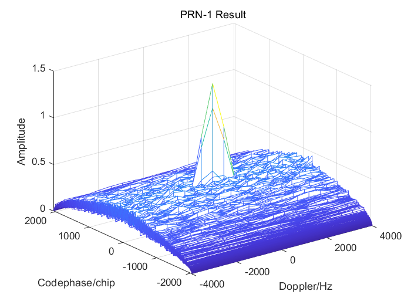

# Task 1: Acquisition

> The `acquisition` function performs a cold start acquisition of GPS signals. It searches for signals from satellites specified in the settings and identifies the code phase and frequency of detected signals.


## Inputs

- **longSignal**: A segment of raw signal data (11 ms) from the GNSS front-end.
- **settings**: A structure containing receiver settings, including:
  - Sampling frequency
  - Intermediate frequency
  - List of satellites to be acquired (`acqSatelliteList`)
  - Acquisition threshold

## Outputs

- **acqResults**: A structure containing:
  - `carrFreq`: Carrier frequencies of detected signals (set to 0 if not detected).
  - `codePhase`: Code phases of detected signals.
  - `peakMetric`: Correlation peak ratios of detected signals.
#### Acquisition_result of Opensky dataset

#### Acquired signals from Opensky dataset

#### Acquired signals from Urban dataset


# Task 2: Tracking

> This MATLAB toolkit implements GPS signal tracking loops (DLL/PLL) with multi-correlator configuration and tracking performance analysis, providing specialized visualization capabilities for urban multipath interference scenarios.

## Features
1. **Configurable Delay Lock Loop (DLL)**
   - Adjustable Early-Late (E-L) correlator spacing
   - Non-coherent delay discriminator implementation
   - Tunable parameters: noise bandwidth (0.1-5Hz), integration time

2. **Multi-Correlator Architecture**
   - 11 correlators with ±0.1 to ±0.4 chip offsets
   - Real-time I/Q channel correlation recording
   - Correlation function reconstruction and visualization

3. **Urban Interference Analysis**
   - Multipath-induced correlation peak distortion detection
   - Signal power and tracking stability metrics calculation
   - Dynamic environment tracking robustness evaluation

## Inputs

- **channel**: Structure containing PRNs, carrier frequencies, and code phases of satellites to be tracked.
- **settings**: Receiver settings, including:
  - Number of channels
  - Sampling frequency
  - DLL and PLL noise bandwidths
  - Correlator spacing

## Outputs

- **trackResults**: Structure array containing tracking results:
  - In-phase prompt outputs
  - Absolute spreading code's starting positions
  - Loop discriminator outputs
  - Code and carrier frequencies

### Multi-Correlator Configuration
```matlab
% Correlator layout (unit: chip)
corrOffsets = [-0.4, -0.3, -0.2, -0.1, 0, +0.1, +0.2, +0.3, +0.4];

% Signal correlation calculation (code snippet)
if settings.multicorr == 1
    trackResults(channelNr).I_multi{loopCnt} = [I_E04, I_E03, ..., I_L04];
    trackResults(channelNr).Q_multi{loopCnt} = [Q_E04, Q_E03, ..., Q_L04]; 
end
```


#### Tracking channel1 PRN1 (Urban)

#### Tracking channel2 PRN3 (Urban)

#### Tracking channel3 PRN11 (Urban)

#### Tracking channel4 PRN18 (Urban)


# Task 3: Navigation Data Decoding

> The `postNavigation` function calculates navigation solutions for a GNSS receiver, including pseudoranges and positions. It also converts coordinates from the WGS84 system to UTM and other coordinate systems.


## Inputs

- **trackResults**: Structure array containing results from the tracking function.
- **settings**: Receiver settings, including:
  - Number of channels
  - Sampling frequency
  - Elevation mask
  - Navigation solution period

## Outputs

- **navSolutions**: Structure containing:
  - Measured pseudoranges
  - Receiver clock error
  - Receiver coordinates in ECEF and UTM
  - Satellite positions and velocities
- **eph**: Structure array of received ephemerides for all satellites.


# Task 4: Position and Velocity Estimation


> This MATLAB implementation uses tracked pseudorange measurements and Doppler data to calculate receiver positions and velocities through a Weighted Least Squares (WLS) algorithm. The solution includes visualization of trajectories and analysis of multipath effects.

## Key Features
1. **WLS Positioning Engine**
   - Processes pseudorange and Doppler measurements from multiple satellites
   - Implements elevation-dependent weighting matrix for measurements
   - Solves for 3D position, velocity, and clock parameters
   - Supports both WLS and Extended Kalman Filter (EKF) implementations

2. **Visualization Capabilities**
   - 3D trajectory plotting in ECEF coordinates
   - 2D UTM position plots with error ellipses
   - Velocity vector visualization
   - Sky plot of satellite constellations

3. **Error Analysis**
   - Position/velocity error calculation against reference trajectories
   - Dilution of Precision (DOP) metrics visualization
   - Residual analysis for multipath detection


### WLS Core Algorithm (`leastSquarePos` function)
```matlab
% Weight matrix construction (elevation-based weighting)
W = diag(1 ./ (sin(el) + 0.1).^2);  % Elevation angle weighting

% Measurement model
H = [line_of_sight_vectors, ones(nSats,1), zeros(nSats,3);
     zeros(nSats,3),        ones(nSats,1), line_of_sight_vectors];

% WLS solution
delta_x = inv(H'*W*H) * H'*W * residuals;
```

#### Navigation data decoding and Position/ Velocity Estimation (Urban)


#### Navigation data decoding and Position/ Velocity Estimation (Opensky)


# Task 5: Kalman Filter-Based Positioning

> This MATLAB implementation of an Extended Kalman Filter (EKF) estimates user position and velocity using pseudorange and Doppler measurements from GNSS satellites.

## Features
- Fuses pseudorange (code) and Doppler measurements
- Estimates 8 states: 3D position, 3D velocity, clock bias, and clock drift
- Accounts for satellite motion and Earth rotation effects
- Configurable measurement noise parameters

### Input Parameters
| Parameter    | Description                          | Format          |
|--------------|--------------------------------------|-----------------|
| satPos       | Satellite positions (ECEF)           | 3×N matrix [m]  |
| satVel       | Satellite velocities (ECEF)          | 3×N matrix [m/s]|
| obs          | Pseudorange measurements            | 1×N vector [m]  |
| dopplers     | Doppler measurements                 | 1×N vector [Hz] |
| settings     | Configuration parameters             | struct          |
| X            | Previous state vector                | 8×1 vector      |
| P            | Previous error covariance            | 8×8 matrix      |
| Q            | Process noise covariance             | 8×8 matrix      |

### Outputs
- `X_k`: Updated state vector [x,y,z, vx,vy,vz, clk_bias, clk_drift]
- `P_k`: Updated error covariance matrix

## Algorithm Overview
1. **Time Update**
   - State prediction using constant velocity model
   - Covariance prediction with process noise

2. **Measurement Update**
   - Construct measurement matrix H for pseudorange/Doppler
   - Earth rotation correction for satellite positions
   - Kalman gain calculation
   - State and covariance updates

## Key Parameters
```matlab
settings.navSolPeriod = 100;    % Navigation solution period [ms]
settings.c = 299792458;         % Speed of light [m/s]
R_pseudo = 1000;                % Pseudorange measurement noise [m]
R_doppler = 10000;              % Doppler measurement noise [m/s]